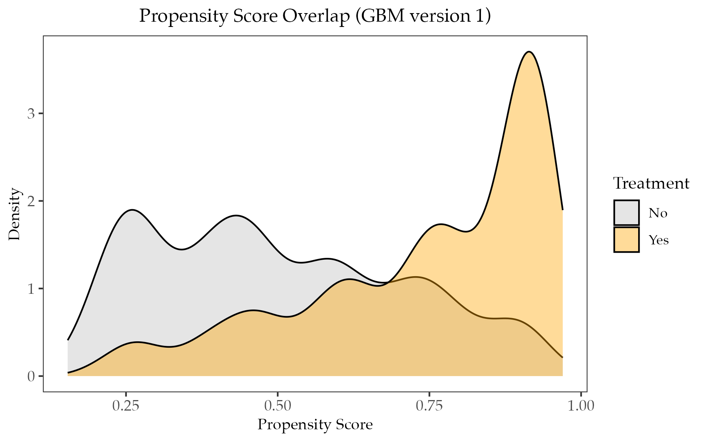
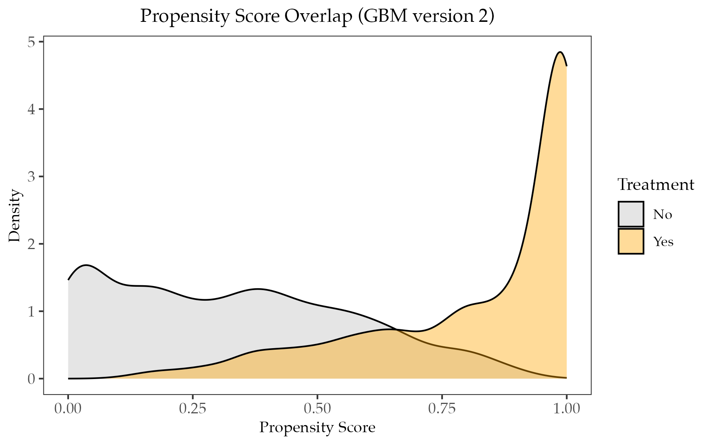

# Propensity Score Weighting

1. We showed in lecture that propensity function $e(X_i)$ can be used to construct ATE under CIA and \textit{common support}. This is the same formula we use in \textit{Inverse Propensity Weighting} (IPW).

$$    
  \begin{aligned}
      E[Y_i(1)-Y_i(0)] &= E\left[\frac{Y_iD_i}{e(X_i)} - \frac{Y_i(1-D_i)}{1-e(X_i)} \right] \\
      &= E\left[ \frac{(D_i-e(X_i))Y_i}{e(X_i)(1-e(X_i)} \right]
  \end{aligned}
$$

Now we are interested in the estimand of ATT using IPW. Show that the equation below holds true.

$$
\begin{aligned}
    E[Y_i(1)-Y_i(0) \mid D_i=1] = E\left[ \frac{(D_i-e(X_i))Y_i}{(1-e(X_i))P(D_i=1)} \right]
\end{aligned}
$$

2. In deriving ATE or ATT using a sample, we want to estimate the true underlying propensity function $e(X_i)$. Below are the distribution of predicted propensity scores from the same dataset but using two different prediction methods. Both predictions are based on the method of boosted trees, but they differ by the number of trees and the depth of trees. 

- (a) One of the two predictions uses 500 trees with depth 3, and the other uses 50000 trees with depth 6. Which version of the figure below likely uses 500 trees with depth 3?

- (b) If covariates are balanced after reweight using both versions of propensity score, which version should be preferred and why?

::: {layout-ncol=1}
{fig-alt="Figure 1" width="100%"}
{fig-alt="Figure 2" width="100%"}
:::

3. In the updated file `PSweight.qmd` in Week 6, I demonstrated the use of `PSweight()` in estimating the treatment effect based on the propensity score estimated by boosted trees. I arbitrarily used 500 trees with depth 3. A more formal approach is to do a grid search using different combinations of number and size of trees. The best combo should have the minimal model complexity (i.e., fewer number of trees and shallower depth) but achieve covariate balance and reasonably large effective sample size. Now consider the codes implementing the idea below.

```{r grid search IPW, warning=FALSE, message=FALSE, eval=FALSE}
library(PSweight)
library(SuperLearner)
library(ggplot2)

## load NCDS dataset
data("NCDS", package="PSweight")

## covariates
covars <- c("white", "maemp", "qmab2", "paed_u", "maed_u", "agepa")

## define propensity score
ps.formula  <- reformulate(covars, response = "Dany")

## grid search combination
trees <- c(500, 1000, 2000, 5000)
depths <- c(3, 4, 5, 6)
results <- expand.grid(n.trees = trees, depth = depths)
results$max_amd <- results$ess <- results$ess_frac <- NA

## fit a IPW algorithm using boosted trees
for (i in 1:nrow(results)) {
  fit <- SumStat(
    ps.formula = ps.formula,
    data = NCDS,
    weight = "IPW",
    method = "gbm",
    ps.control = list(n.trees = results$n.trees[i],
                      interaction.depth = results$depth[i])
  )
  
  ## calculate ESS
  w <- fit$ps.weights$IPW      ## extract normalized IPW
  w <- w * nrow(NCDS) / sum(w) ## rescale so total weight = sample size
  ess <- (sum(w)^2) / sum(w^2) ## effective sample size (ESS) combining both treated and controlled obs.
  results$ess[i] <- ess
  results$ess_frac[i] <- ess / nrow(NCDS) ## the ratio of ESS against sample size

  ## calculate absolute standardized distance (i.e., a measure of difference) for each covariate after IPW weight
  ## store the largest ASD across covariates
  results$max_amd[i] <- max(abs(fit$IPW.sumstat[ , "ASD weighted var 1-2"]))
}
```

- (a) Reading the codes above, in your own words, describe what effective sample size (ESS) potentially measures, and why a reasonably large ESS is preferred.

- (b) Now run the codes above, check the output `results`, and justify your preferred selection of the combo (i.e., which combination of tree number and size).

# Instrumental Variable Estimation with Double Machine Learning

1. Consider the DAGs below, where we want to estimate the causal effect of $D$ on $Y$. For each DAG, discuss briefly whether variable $Z$ can be used as a valid instrument, and what variables need to be conditioned on for $Z$ to be valid, if needed. Variables in a dashed circle means they are unobserved.

\begin{center}
\begin{tikzpicture}[
>=stealth,
scale=0.65,
thick,
every node/.style={scale=1.1},
]

%% case 1
% nodes
\node (D) at (0,0) {$D$};
\node[circle,draw,dashed,inner sep=2pt] (U) at (1.5,-2.5) {$U$};
\node (Y) at (3,0) {$Y$};
\node (Z) at (-3,0) {$Z$};
\node (X) at (-1.5,2.5) {$X$};

% arrows
\draw[->] (Z) -- (D);
\draw[->] (D) -- (Y);
\draw[->] (U) -- (D);
\draw[->] (U) -- (Y);
\draw[->] (Z) -- (X);
\draw[->] (X) -- (D);

%% case 2
% nodes
\node (D) at (8,0) {$D$};
\node[circle,draw,dashed,inner sep=2pt] (U) at (9.5,-2.5) {$U$};
\node (Y) at (11,0) {$Y$};
\node (Z) at (5,0) {$Z$};
\node (X) at (6.5,2.5) {$X$};

% arrows
\draw[->] (D) -- (Z);
\draw[->] (D) -- (Y);
\draw[->] (U) -- (D);
\draw[->] (U) -- (Y);
\draw[->] (X) -- (Z);
\draw[->] (X) -- (D);

%% case 3
% nodes
\node (D) at (16,0) {$D$};
\node[circle,draw,dashed,inner sep=2pt] (U) at (17.5,-2.5) {$U$};
\node (Y) at (19,0) {$Y$};
\node[circle,draw,dashed,inner sep=2pt] (V) at (13,0) {$V$};
\node (Z) at (14.5,2.5) {$Z$};
\node (X) at (17.5,2.5) {$X$};

% arrows
\draw[->] (Z) -- (D);
\draw[->] (D) -- (Y);
\draw[->] (U) -- (D);
\draw[->] (U) -- (Y);
\draw[->] (V) -- (Z);
\draw[->] (V) -- (D);
\draw[->] (X) -- (D);
\draw[->] (X) -- (Y);
\end{tikzpicture}
\end{center}

2. Remember in the week of DAG, we briefly considered the estimation of the effect of 401(k) participation on accumulated assets. 401(k) plans are pension accounts sponsored by employers. The key problem in determining the effect of participation in 401(k) plans on accumulated assets is the fact that the decision to enroll in a 401(k) is non-random. It is generally recognized that some people have a higher preference for saving than others. It also seems likely that those individuals with high unobserved preference for saving would be most likely to choose to participate in tax-advantaged retirement savings plans and would tend to have otherwise high amounts of accumulated assets. The presence of unobserved savings preferences with these properties then implies that conventional estimates that do not account for saver endogeneity of participation will be biased.

One can argue that eligibility for enrolling in a 401(k) plan in this data can be taken as *exogenous* after conditioning on a few observables of which the most important one may be income. The basic idea is that, at least around the time 401(k) initially became available, people were unlikely to be basing their employment decisions on whether an employer offered a 401(k) but would instead focused on income and other aspects of the job.

```{r 401k load data, warning=FALSE, message=FALSE}
## import library
library(hdm)
library(sandwich)
library(ggplot2)
library(randomForest)
library(glmnet)
library(gbm)
library(data.table)
library(xtable)

## load data
data <- read.csv("https://raw.githubusercontent.com/CausalAIBook/MetricsMLNotebooks/main/data/401k.csv")
dim(data)
```

The data consist of 9,915 observations at the household level drawn from the 1991 Survey of Income and Program Participation (SIPP). All the variables are referred to 1990. We use net financial assets (`net_tfa`) as the outcome variable, $Y$, in our analysis. The net financial assets are computed as the sum of IRA balances, 401(k) balances, checking accounts, saving bonds, other interest-earning accounts, other interest-earning assets, stocks, and mutual funds less non-mortgage debts. The binary variable `e401` indicates eligibility and binary variable `p401` indicates participation, respectively.

```{r 401k construct variables, warning=FALSE, message=FALSE}
## instrument variable
Z <- data[, "e401"]

## treatment variable
D <- data[, "p401"]

## outcome variable
y <- data[, "net_tfa"]

## constructing controls
x_formula <- paste("~ poly(age, 6, raw=TRUE) + poly(inc, 8, raw=TRUE) + poly(educ, 4, raw=TRUE) + ",
                   "poly(fsize, 2, raw=TRUE) + male + marr + twoearn + db + pira + hown")
X <- as.data.table(model.frame(x_formula, data))
```

- (a) Now consider using post-LASSO to partial out the confoundedness of covariates. Write down the OLS and IV point estimate in the chunk below. You do not need to report SE. Do not use any functions for this task.

```{r IV OLS estimation, warning=FALSE, message=FALSE}
set.seed(123)

## post-LASSO with default plug-in penalty
yfit_lasso <- hdm::rlasso(as.matrix(X), y, post=TRUE)
dfit_lasso <- hdm::rlasso(as.matrix(X), D, post=TRUE)
zfit_lasso <- hdm::rlasso(as.matrix(X), Z, post=TRUE)

## residualize variables
yhat_lasso <- predict(yfit_lasso, newdata = as.matrix(X)) # predictions
dhat_lasso <- predict(dfit_lasso, newdata = as.matrix(X)) # predictions
zhat_lasso <- predict(zfit_lasso, newdata = as.matrix(X)) # predictions
resy <- y - yhat_lasso
resD <- D - dhat_lasso
resZ <- Z - zhat_lasso

## your IV and OLS estimation code here
```

- (b) Comparing the magnitude of the two estimates, what can you conclude about the potential omitted variables and their association with 401(k) participation and net financial assets?

- (c) Report the F-statistics for the first stage and discuss whether a weak instrument problem is present.

```{r weak instrument, warning=FALSE, message=FALSE}
## your code testing weak instrument
```

- (d) In the possible presence of a weak instrument, we may use the Anderson and Rubin's approach to construct the 95\% confidence interval. Complete the function by specifying the statistic $C(\theta)$. Does your 95\% confidence interval cover the IV point estimate reported above?

```{r AR method, warning=FALSE, eval=FALSE}
weakIV_inference <- function(resD, resy, resZ, grid, alpha = 0.05) {

  ## define the threshold based on chisq distribution
  thr <- qchisq(1 - alpha, df = 1)
  accept <- c()
  n <- length(resD)

  ## define the grid search of theta (i.e., the point estimate)
  for (theta in grid) {
    
    ## your code
    Ctheta <- ##
    if (Ctheta <= thr) {
      accept <- c(accept, theta)
    }
  }

  ## retrieve accept
  return(accept)
}

## report your result
grid <- seq(0, 20000, length.out = 10000)
region <- weakIV_inference(resD, resy, resZ, grid = grid)
```

